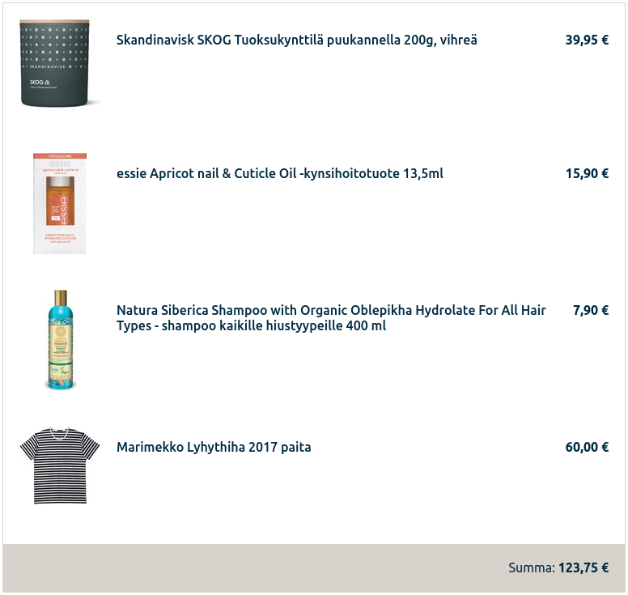

This is a generic test project, kinda (not even close) similar for what we have in production, it is an **nextjs** **react** & **typescript** app, which uses **apollo graphql-client** to fetch data from our api and components are styled with **styled-components**.

- we do not expect you to be familiar with all of these, you can also use pure css for styling, (using `import 'some-style.css'` should work, for scss you might need to add node-sass) if you feel more at home with it.
- this is a very rough setup, nothing too fancy has been added, we do not expect you to add/install any 3rd party libraries or tools, but you could, if you want, but you should be able to explain why.

## pre-requirements

you should have

- git
- npm

```bash
  > git clone https://gitlab.sok.fi/sok-digikehitys/recruitment/nextjs-store-test-app.git
  > npm i
  > npm run dev
```

\-> profit?

## Task

"improve as you see fit"

do, talk, point out, refactor, improve as much as you like and where you see fit, but keep in mind, purpose of this is just to get to know your "level", not how much of time you can spend on interview tasks... we can do this in a "live" session and have a chat or you can do it all by yourself, whichever works for you the best.

if you feel that something is too complicated, do not do it.

some ideas, what to do (do whatever you want, not from these)

- style
  - make list items, in `[storeid].tsx` page to look like this 
  - make cart and the containing view independently scrollable
  - align view layout, make title to be on its own row
  - responsive layout
  - style index.tsx?
  - ?
- shopping cart functionality at `[storeid].tsx`,
  - add possibility to remove items
  - display images on the cart
  - prevent multiples of same items to be added, increase/decrease count instead
  - make cart global, to stay on memory even if user navigates to different view
- typing
- functions
- loding, error..
